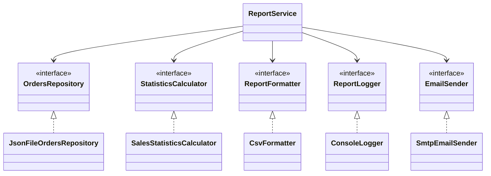

```mermaid
classDiagram
class ReportService
class OrdersRepository {
  <<interface>>
}
class StatisticsCalculator {
  <<interface>>
}
class ReportFormatter {
  <<interface>>
}
class ReportLogger {
  <<interface>>
}
class EmailSender {
  <<interface>>
}

class JsonFileOrdersRepository
class SalesStatisticsCalculator
class CsvFormatter
class ConsoleLogger
class SmtpEmailSender

ReportService --> OrdersRepository
ReportService --> StatisticsCalculator
ReportService --> ReportFormatter
ReportService --> ReportLogger
ReportService --> EmailSender

OrdersRepository <|.. JsonFileOrdersRepository
StatisticsCalculator <|.. SalesStatisticsCalculator
ReportFormatter <|.. CsvFormatter
ReportLogger <|.. ConsoleLogger
EmailSender <|.. SmtpEmailSender
```
